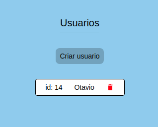
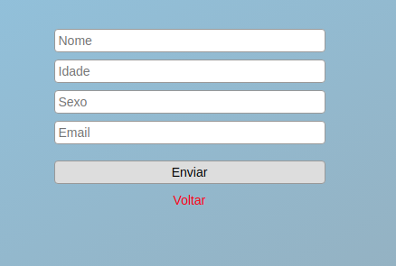
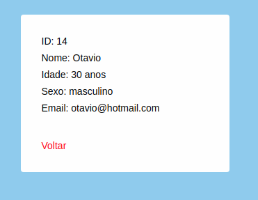

** Exercicio do sistema de gerenciamento de usuarios **

Acessar o back-end atraves HTTP request usamos a lib Axios:
https://github.com/axios/axios

Sistema de navegacao de rotas
https://reacttraining.com/react-router/web/guides/quick-start

Enviar o state ou params atraves do component Link do React Router
https://tylermcginnis.com/react-router-pass-props-to-link/

Estilizacao de components
https://www.styled-components.com/docs/basics

Utilizamos a nova feature do React os Hooks
https://pt-br.reactjs.org/docs/hooks-intro.html

As telas do sistema :

